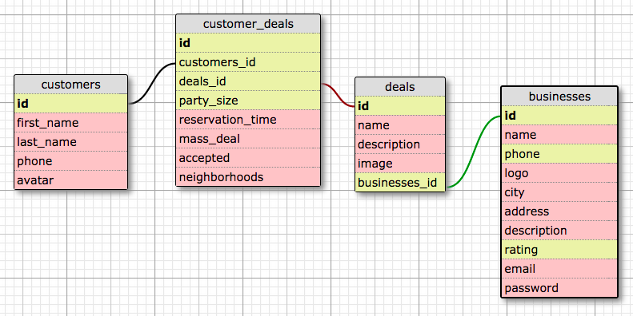
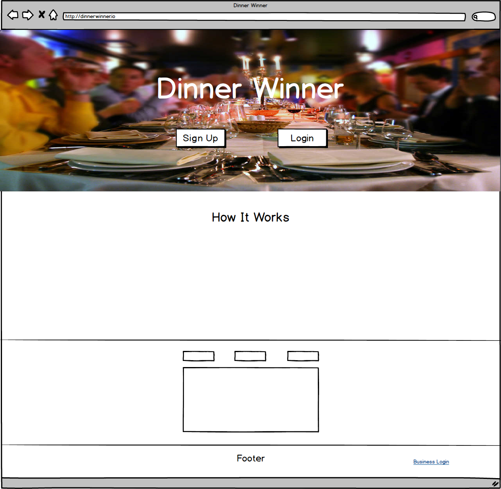
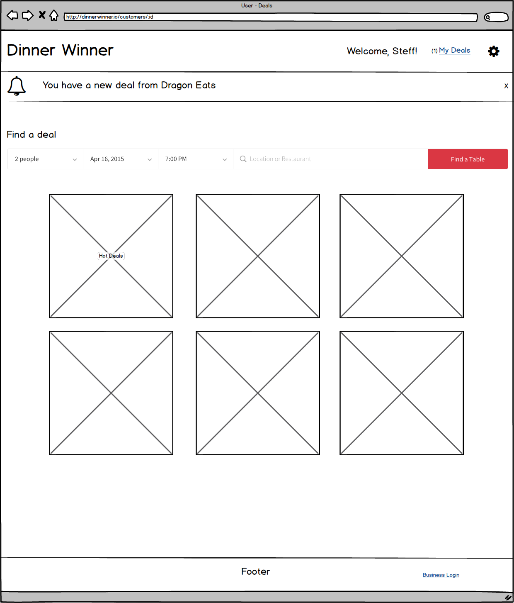
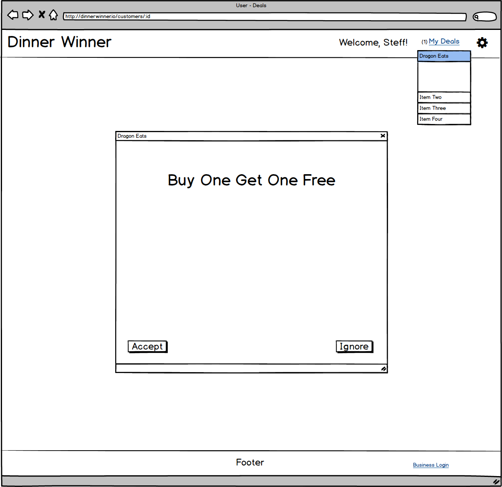
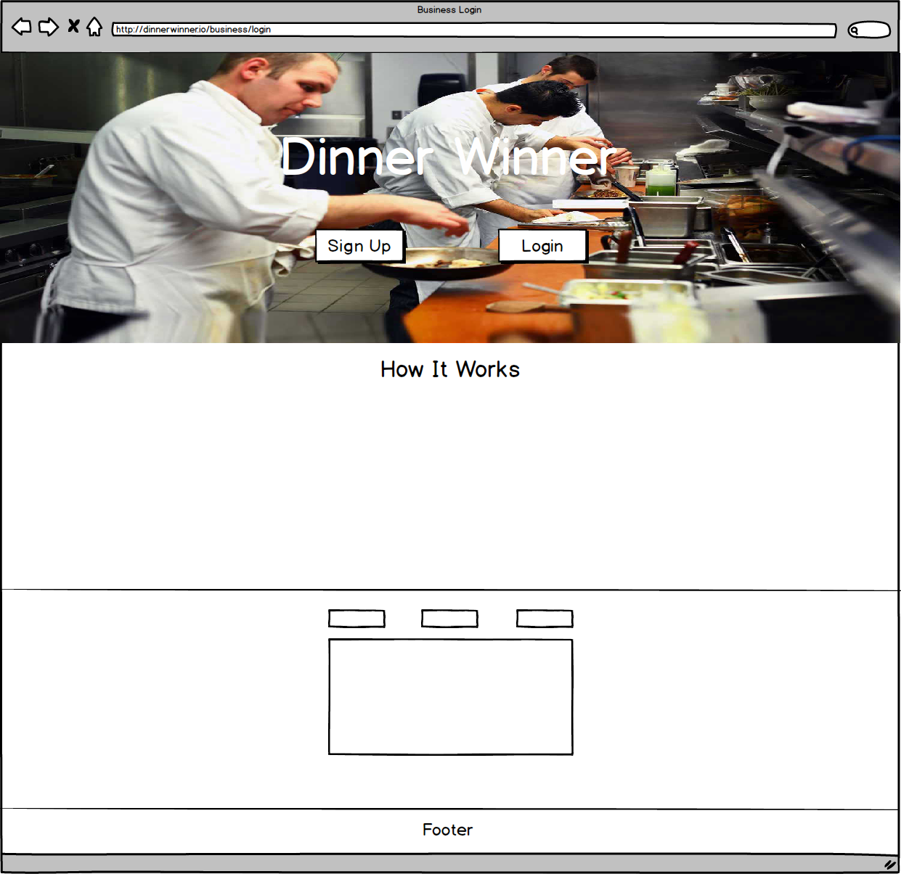
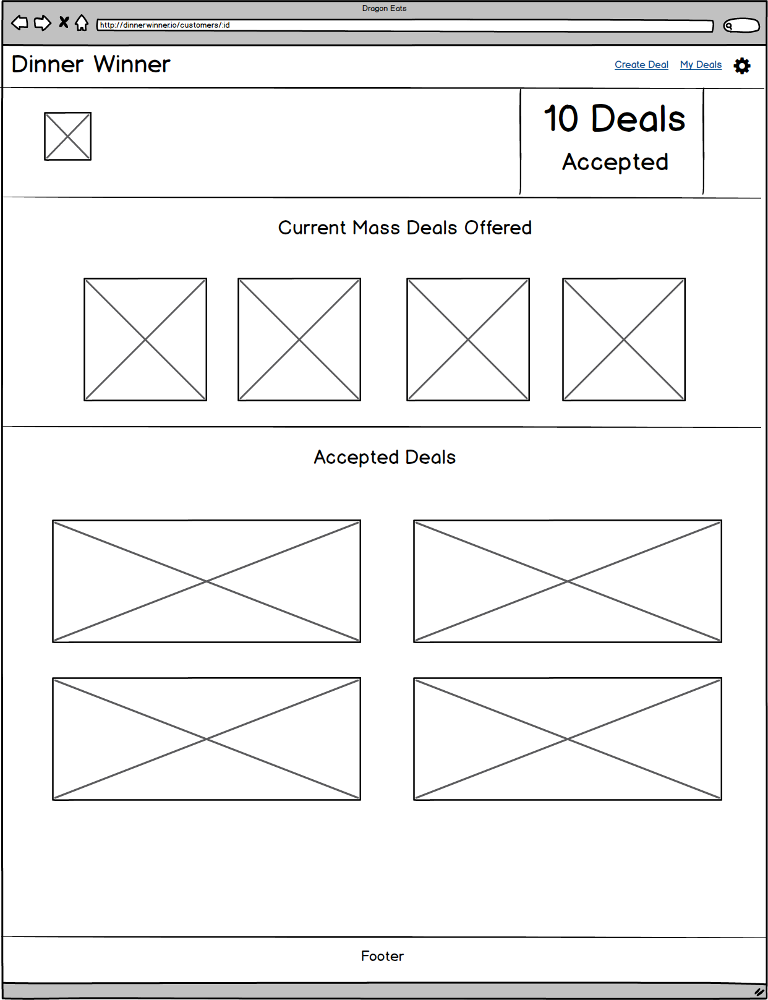
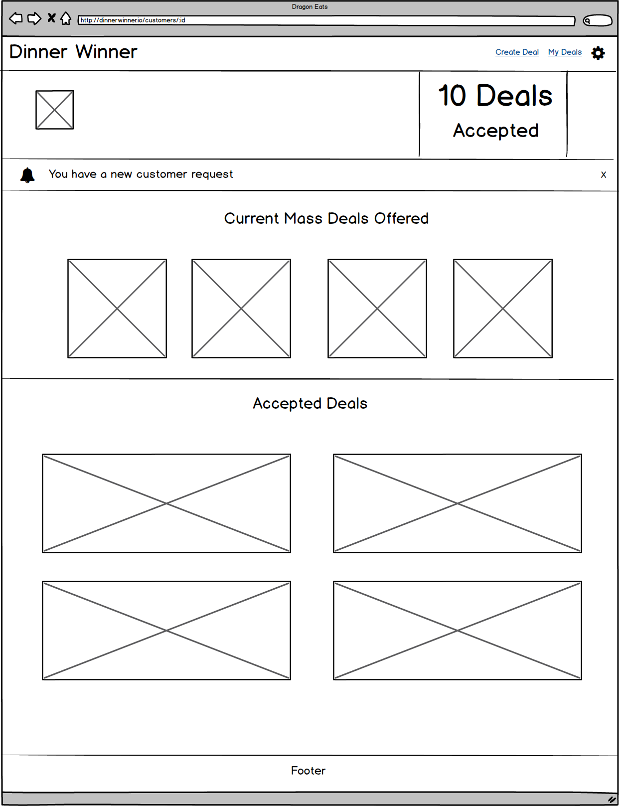
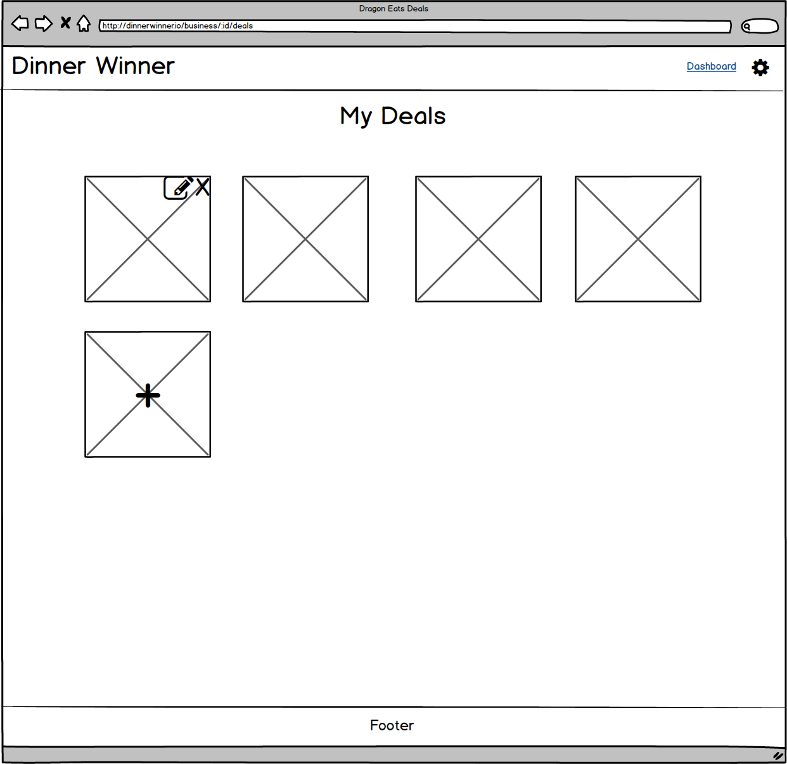

# Dinner Winner
Winner Winner, Chicken Dinner!

### Summary

### Goals
	
### Strech Goals
	* Passbook
	* 
### Installation / Usage

### Technologies

### API's

### Gems
- [Devise](https://github.com/plataformatec/devise)
- [Twilio-ruby](https://github.com/twilio/twilio-ruby)
- [Passbook-ruby](https://github.com/xtremelabs/xl-passbook-ruby/)
- [Paperclip](https://github.com/thoughtbot/paperclip/tree/master)

### Contribution
	- Stephanie Lopez
	- Iulia Soimaru
	- Matt Lao
	- Curtis Seaton

### Wireframes

